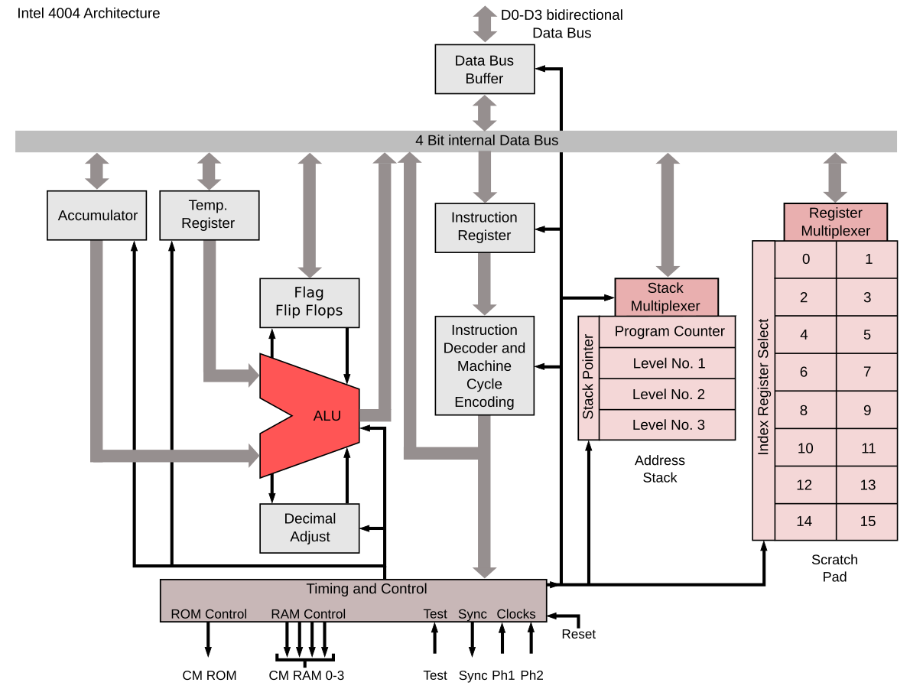

# Intel-4004-Design

The Intel 4004, released in 1971, was the world's first commercially available microprocessor, a complete general-purpose CPU on a single chip. It marked a pivotal moment in computing history, enabling the development of smaller, more powerful devices, and is considered a key factor in the rise of Intel to processor dominance
Here's my implementation of it in verilog HDL 

(Intel 4004 is a Harward Architecture and not a Von-Neumann Architecture)

Good Read : https://medium.com/@iamRadhaKulkarni/the-story-of-the-first-microprocessor-how-intel-4004-changed-computing-forever-4b77945f08fe

Datasheet : https://datasheets.chipdb.org/Intel/MCS-4/datashts/intel-4004.pdf

ARCHITECTURE : 

